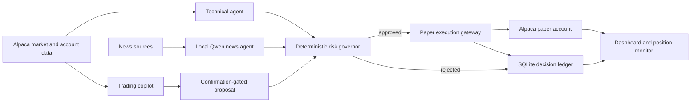

# Lattice — Explainable AI Paper Options Desk

Lattice is a local-first, explainable trading workspace built for the
[Alpaca AI Trading Agents Hackathon](https://lablab.ai/ai-hackathons/alpaca-ai-trading-agents-hackathon).
It combines deterministic technical analysis, optional local-LLM news analysis,
configurable risk controls, and Alpaca paper execution in one auditable workflow.

> [!WARNING]
> Lattice is experimental software for paper trading and research. It is not
> financial advice, does not promise returns, and should not be connected to a
> live brokerage account.


## Why Lattice

Language models can help interpret markets, but they should not have unchecked
control over capital. Lattice separates research, decision-making, risk review,
and execution:

- Technical signals are computed deterministically from market data.
- A local Qwen model can independently evaluate recent company news.
- A deterministic risk manager can reject any proposed trade.
- Every paper order has a bounded size, price, maximum loss, stop, and target.
- The conversational copilot prepares a proposal first and requires an explicit
  confirmation before submission.
- Decisions and rejections are recorded in a local SQLite ledger.

## Features

- **Technical decision agent** — regime classification plus trend-following,
  mean-reversion, and breakout signals.
- **Options contract selection** — filters contracts by expiration, delta,
  bid/ask spread, volume, open interest, tradability, and affordability.
- **Explainable risk governor** — enforces daily-loss, portfolio-risk,
  per-trade-risk, position-count, cooldown, and market-close rules.
- **Position supervision** — evaluates stop-loss, take-profit, holding-time,
  expiry, and account-level risk conditions.
- **Independent news agent** — gathers and deduplicates stories from Alpaca,
  Google News RSS, company feeds, and optional secondary sources before local
  Qwen analysis.
- **Trading copilot** — uses Qwen and the Alpaca MCP server for conversational
  research and confirmation-gated paper proposals.
- **Audit trail** — stores technical and news decisions, risk outcomes, and
  execution state locally.
- **Read-only public demo mode** — tunnel visitors can inspect the dashboard,
  while strategy and risk controls remain restricted to localhost.

## Architecture



The autonomous runner uses the Alpaca CLI for paper execution. The copilot also
connects to Alpaca through its MCP server. Alpaca credentials and the local Qwen
model remain on the machine running Lattice.

## Safety model

The default policy is deliberately conservative:

- Alpaca paper endpoint by default
- 0.25% maximum account risk per trade
- 0.75% daily loss limit
- 2% maximum aggregate portfolio risk
- Three open positions and three entries per day
- Defined maximum premium loss for long options
- Liquidity, spread, delta, expiration, and quote-freshness checks
- Deterministic client order identifiers for duplicate protection
- Public dashboard controls rejected unless the request originates locally

Risk settings are editable from the local Account page and are revalidated on
the server. Dashboard and copilot execution remain disabled unless explicitly
enabled in the local environment; the autonomous runner can submit paper orders
only when autonomous execution is explicitly enabled and a strategy passes
every risk gate.

## Requirements

- Node.js 22.13 or newer
- An Alpaca paper-trading account with options access
- The official Alpaca CLI for autonomous paper execution
- `uvx` and `alpaca-mcp-server` for copilot tool access
- [Ollama](https://ollama.com/) with `qwen3:8b` for local news and conversation
  analysis

Optional news integrations can use Finnhub and Alpha Vantage API keys. The
default news pipeline can also use Alpaca, Google News RSS, and configured
company feeds without those additional keys.

## Quick start

1. Install dependencies:

   ```bash
   npm ci
   ```

2. Create the local configuration:

   ```bash
   cp .env.example .env.local
   ```

   On PowerShell:

   ```powershell
   Copy-Item .env.example .env.local
   ```

3. Add the Alpaca **paper** credentials to `.env.local`. Keep
   `ALPACA_API_BASE_URL=https://paper-api.alpaca.markets` and set
   `ALPACA_EXPECTED_ACCOUNT_ID` to the intended paper account.

4. Install and start the local model:

   ```bash
   ollama pull qwen3:8b
   ```

5. Start the local workspace:

   ```bash
   npm run dev
   ```

6. Open `http://localhost:3000`.

The dashboard can be explored without credentials using representative mock
data. Agent controls and live paper-account data require local configuration.

## Running agents

Agent execution is opt-in. Review `.env.example`, confirm the account guard,
then enable only the autonomous strategy you intend to run:

```env
ALPACA_EXPECTED_ACCOUNT_ID=your-paper-account-id
AUTONOMOUS_EXECUTION_ENABLED=false
TECHNICAL_STRATEGY_ENABLED=true
NEWS_STRATEGY_ENABLED=false
```

Start the dashboard first, then run:

```bash
npm run agents:run
```

The autonomous runner refuses missing credentials or a missing expected account
ID, forces the Alpaca CLI into paper mode, and checks the configured account
before submitting an order. A strategy can analyze and create ready proposals
while `AUTONOMOUS_EXECUTION_ENABLED=false`. Change that flag to `true` only when
you are ready for approved proposals to become paper orders.

## Verification

Run the focused agent suite:

```bash
npm run test:agents
```

Additional commands:

```bash
npm run test:decision
npm run lint
npm run build
```

The test suite covers decision indicators, signal evaluation, scheduling,
risk decisions, execution idempotency, news acquisition, the decision ledger,
and copilot confirmation behavior.

## Research harness

The research notebook and command-line harness call the production TypeScript
decision agent rather than reimplementing its rules. They evaluate directional
signal quality against future underlying returns while keeping research metrics
separate from paper-trade execution results.

See [research/decision-maker/README.md](research/decision-maker/README.md) for
usage.

## Public demo

The demo supervisor keeps the dashboard and Cloudflare Tunnel running while
leaving credentials, Ollama, execution, and SQLite on the local machine.

```bash
npm run build
npm run public:demo
```

See [HOSTING.md](HOSTING.md) for setup and operational notes. Public requests
are read-only; configuration and execution controls are limited to localhost.

## Project structure

```text
app/                         Dashboard pages and server routes
components/dashboard/        Account, risk, strategy, trade, and copilot UI
lib/agents/                   Decision, news, risk, execution, and ledger logic
lib/alpaca/                   Alpaca read and paper-execution gateways
lib/security/                 Local-only control boundary
research/decision-maker/      Backtest harness and notebook
scripts/                      Local runner and public-demo supervisors
skills/trading-assistant/     Copilot behavior and safety instructions
```

## Privacy and secrets

- `.env.local`, `.data/`, research outputs, build output, and local tool binaries
  are ignored by Git.
- Never prefix Alpaca credentials with `NEXT_PUBLIC_`.
- Never commit paper-account identifiers, order exports, tunnel tokens, or
  SQLite databases.
- Rotate a credential immediately if it is ever committed, even if the commit
  is later removed.

## Demo scope

- Lattice is designed for Alpaca paper trading and research, not live brokerage
  execution.
- The news agent and conversational copilot use a locally hosted Qwen model
  through Ollama.
- The hosted showcase provides a read-only view with representative data; the
  complete autonomous workflow runs locally so credentials, model inference,
  execution controls, and the decision ledger remain on the user's machine.

## License

Released under the [MIT License](LICENSE). This license covers the software;
the paper-trading and no-financial-advice warnings above still apply.
